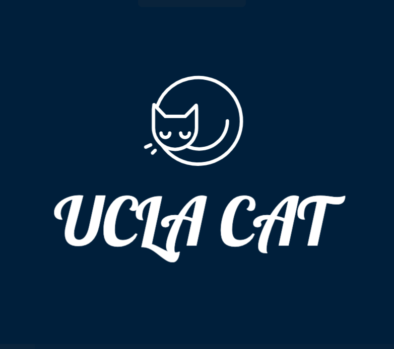

<div id="top"></div>
<!-- PROJECT LOGO -->
<!-- <br />
<div align="center">
  <a href="https://github.com/MubaiHua/Symptom-Monitoring-System-Auto">
    
  </a>
</div>
 -->
 
<!-- ABOUT -->
## 🐱 About

**UCLA CAT** (Covid-symptom-survey Auto-filling Tool) is an automation software that frees UCLA bruins from the annoying daily routine of manually filling out the [Covid Symptom Survey](https://uclasurveys.co1.qualtrics.com/jfe/form/SV_aeH9BFhYVjkYTsO) to show your healthy status.

One click of UCLA CAT completes the survey for you as a healthy status for today. You can schedule the UCLA CAT to run every day at midnight, so you always get a pretty green screen wherever you go.

Here is a demo of how the survey auto-filling runs:

<div align="center">
  
</div>

<!-- INSTALLATION -->
## 📦 Installation

If you're using mac/linux, follow this [setup guide](https://github.com/MubaiHua/ucla-cat/blob/main/mac/setup-guide.md).

If you're using windows, go [here](https://github.com/MubaiHua/ucla-cat/blob/main/win/main.exe) and click Download. Run `main.exe` to auto-fill the survey for today. 


## ✋ Disclaimer

This tool is only for people who have no Covid symptoms, and only serves as a convenient way to fill survey to show a healthy status from day to day. If you have any Covid symptoms, please do not and stop using this tool.

## 🧑‍💻 Built With

* [Python3](https://www.python.org/)
* [Selenium](https://www.selenium.dev/)
* [Bash](https://www.gnu.org/software/bash/)

This project incorporates techniques from [duo-bypass](https://github.com/revalo/duo-bypass) to bypass Duo two-factor authentication. 

<!-- SETUP  -->
## 💻 Set up your project locally

- Install Python 3.7+
- Install pip3
- Clone this project
- Install Python dependencies
```sh
  pip3 install -r requirements.txt
  ```
- Run the Python script
```sh
  python3 main.py
  ```

<!-- UPDATE -->
## 🆙 Update the scirpt
We will try to release new version of the program every time the symptom monitoring survey is changed. If you are unfamiliar with git and github, you may need to go to this website and download the newest version of the program.

  
<!-- CONTRIBUTING  -->
## ✍️ Contributing

-   To request a feature or report bugs: create an issue describing your request.
-   To add a new feature or fix bugs: fork this repository, make code changes, and send a pull request.

Contributions are what make this open source community such an amazing place to learn, inspire, and create. Any contributions you make are **greatly appreciated**.

<!-- SUPPORT  -->
## ❤️ Support This Project

If you like this project, please leave a star ⭐️ on the top right corner of this web page. This helps more people to know our project.

Also check out this [chrome extension](https://github.com/SparkShen02/Easy-Duo-Authentication/) to login into your UCLA account in a snap, without pulling out your phone for Duo two-factor authentication.

[](https://www.buymeacoffee.com/jeffreyyu)
